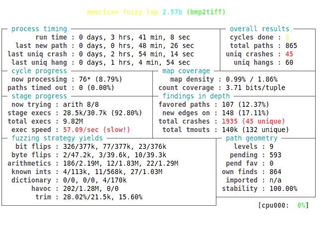

# around-AFL

# CVE-2014-9330

<pre>
# wget http://download.osgeo.org/libtiff/old/tiff-3.8.2.tar.gz
# tar xvzf tiff-3.8.2.tar.gz
# cd tiff-3.8.2
# export CC=afl-gcc
# export CXX=afl-g++
# ./configure --disable-shared
# make
# ls ./tools
# cp /tools/bmp2tiff .
</pre>

<pre>
# ./gen.sh list-crash 2>&1 | tee output
</pre>

<pre>
[0]
./gen.sh: line 11: 16162 Segmentation fault      ./bmp2tiff ${COUNT}.bmp out.tiff
[1]
./gen.sh: line 11: 16166 Segmentation fault      ./bmp2tiff ${COUNT}.bmp out.tiff
[2]
./gen.sh: line 11: 16170 Segmentation fault      ./bmp2tiff ${COUNT}.bmp out.tiff
[3]
./gen.sh: line 11: 16174 Segmentation fault      ./bmp2tiff ${COUNT}.bmp out.tiff
[4]
./gen.sh: line 11: 16178 Segmentation fault      ./bmp2tiff ${COUNT}.bmp out.tiff
[5]
./gen.sh: line 11: 16182 Segmentation fault      ./bmp2tiff ${COUNT}.bmp out.tiff
[6]
./gen.sh: line 11: 16186 Segmentation fault      ./bmp2tiff ${COUNT}.bmp out.tiff
[7]
./gen.sh: line 11: 16190 Segmentation fault      ./bmp2tiff ${COUNT}.bmp out.tiff
[8]
./gen.sh: line 11: 16194 Segmentation fault      ./bmp2tiff ${COUNT}.bmp out.tiff
[9]
./gen.sh: line 11: 16198 Segmentation fault      ./bmp2tiff ${COUNT}.bmp out.tiff
[10]
./gen.sh: line 11: 16202 Segmentation fault      ./bmp2tiff ${COUNT}.bmp out.tiff
[11]
./gen.sh: line 11: 16206 Segmentation fault      ./bmp2tiff ${COUNT}.bmp out.tiff
[12]
./gen.sh: line 11: 16210 Segmentation fault      ./bmp2tiff ${COUNT}.bmp out.tiff
[13]
./gen.sh: line 11: 16214 Segmentation fault      ./bmp2tiff ${COUNT}.bmp out.tiff
[14]
./gen.sh: line 11: 16218 Segmentation fault      ./bmp2tiff ${COUNT}.bmp out.tiff
[15]
./gen.sh: line 11: 16222 Segmentation fault      ./bmp2tiff ${COUNT}.bmp out.tiff
[16]
free(): invalid pointer
./gen.sh: line 11: 16226 Aborted                 ./bmp2tiff ${COUNT}.bmp out.tiff
[17]
free(): invalid pointer
./gen.sh: line 11: 16230 Aborted                 ./bmp2tiff ${COUNT}.bmp out.tiff
[18]
free(): invalid pointer
./gen.sh: line 11: 16234 Aborted                 ./bmp2tiff ${COUNT}.bmp out.tiff
[19]
./gen.sh: line 11: 16238 Segmentation fault      ./bmp2tiff ${COUNT}.bmp out.tiff
[20]
./gen.sh: line 11: 16243 Segmentation fault      ./bmp2tiff ${COUNT}.bmp out.tiff
[21]
./gen.sh: line 11: 16247 Segmentation fault      ./bmp2tiff ${COUNT}.bmp out.tiff
[22]
./gen.sh: line 11: 16251 Segmentation fault      ./bmp2tiff ${COUNT}.bmp out.tiff
[23]
./gen.sh: line 11: 16255 Segmentation fault      ./bmp2tiff ${COUNT}.bmp out.tiff
[24]
./gen.sh: line 11: 16259 Segmentation fault      ./bmp2tiff ${COUNT}.bmp out.tiff
[25]
./gen.sh: line 11: 16263 Segmentation fault      ./bmp2tiff ${COUNT}.bmp out.tiff
[26]
./gen.sh: line 11: 16267 Segmentation fault      ./bmp2tiff ${COUNT}.bmp out.tiff
[27]
./gen.sh: line 11: 16271 Segmentation fault      ./bmp2tiff ${COUNT}.bmp out.tiff
[28]
./gen.sh: line 11: 16275 Segmentation fault      ./bmp2tiff ${COUNT}.bmp out.tiff
[29]
./gen.sh: line 11: 16279 Segmentation fault      ./bmp2tiff ${COUNT}.bmp out.tiff
[30]
./gen.sh: line 11: 16283 Segmentation fault      ./bmp2tiff ${COUNT}.bmp out.tiff
[31]
free(): invalid pointer
./gen.sh: line 11: 16287 Aborted                 ./bmp2tiff ${COUNT}.bmp out.tiff
[32]
./gen.sh: line 11: 16291 Segmentation fault      ./bmp2tiff ${COUNT}.bmp out.tiff
[33]
./gen.sh: line 11: 16295 Segmentation fault      ./bmp2tiff ${COUNT}.bmp out.tiff
[34]
./gen.sh: line 11: 16299 Segmentation fault      ./bmp2tiff ${COUNT}.bmp out.tiff
[35]
./gen.sh: line 11: 16303 Segmentation fault      ./bmp2tiff ${COUNT}.bmp out.tiff
[36]
./gen.sh: line 11: 16307 Segmentation fault      ./bmp2tiff ${COUNT}.bmp out.tiff
[37]
./gen.sh: line 11: 16311 Segmentation fault      ./bmp2tiff ${COUNT}.bmp out.tiff
[38]
./gen.sh: line 11: 16315 Segmentation fault      ./bmp2tiff ${COUNT}.bmp out.tiff
[39]
./gen.sh: line 11: 16319 Segmentation fault      ./bmp2tiff ${COUNT}.bmp out.tiff
[40]
./gen.sh: line 11: 16323 Segmentation fault      ./bmp2tiff ${COUNT}.bmp out.tiff
[41]
./gen.sh: line 11: 16327 Segmentation fault      ./bmp2tiff ${COUNT}.bmp out.tiff
[42]
./gen.sh: line 11: 16331 Segmentation fault      ./bmp2tiff ${COUNT}.bmp out.tiff
[43]
./gen.sh: line 11: 16335 Segmentation fault      ./bmp2tiff ${COUNT}.bmp out.tiff
[44]
free(): invalid pointer
./gen.sh: line 11: 16339 Aborted                 ./bmp2tiff ${COUNT}.bmp out.tiff
[45]
./gen.sh: line 11: 16343 Segmentation fault      ./bmp2tiff ${COUNT}.bmp out.tiff
[46]
./gen.sh: line 11: 16348 Segmentation fault      ./bmp2tiff ${COUNT}.bmp out.tiff
[47]
free(): invalid pointer
./gen.sh: line 11: 16352 Aborted                 ./bmp2tiff ${COUNT}.bmp out.tiff
[48]
free(): invalid pointer
./gen.sh: line 11: 16356 Aborted                 ./bmp2tiff ${COUNT}.bmp out.tiff
[49]
./gen.sh: line 11: 16360 Segmentation fault      ./bmp2tiff ${COUNT}.bmp out.tiff
[50]
./gen.sh: line 11: 16364 Segmentation fault      ./bmp2tiff ${COUNT}.bmp out.tiff
[51]
./gen.sh: line 11: 16368 Segmentation fault      ./bmp2tiff ${COUNT}.bmp out.tiff
[52]
./gen.sh: line 11: 16372 Segmentation fault      ./bmp2tiff ${COUNT}.bmp out.tiff
[53]
./gen.sh: line 11: 16376 Segmentation fault      ./bmp2tiff ${COUNT}.bmp out.tiff
[54]
free(): invalid pointer
./gen.sh: line 11: 16380 Aborted                 ./bmp2tiff ${COUNT}.bmp out.tiff
[55]
free(): invalid pointer
./gen.sh: line 11: 16384 Aborted                 ./bmp2tiff ${COUNT}.bmp out.tiff
[56]
free(): invalid pointer
./gen.sh: line 11: 16388 Aborted                 ./bmp2tiff ${COUNT}.bmp out.tiff
[57]
free(): invalid pointer
./gen.sh: line 11: 16392 Aborted                 ./bmp2tiff ${COUNT}.bmp out.tiff
</pre>
